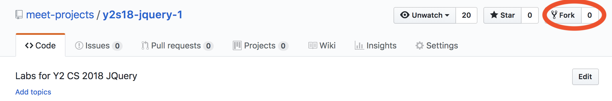
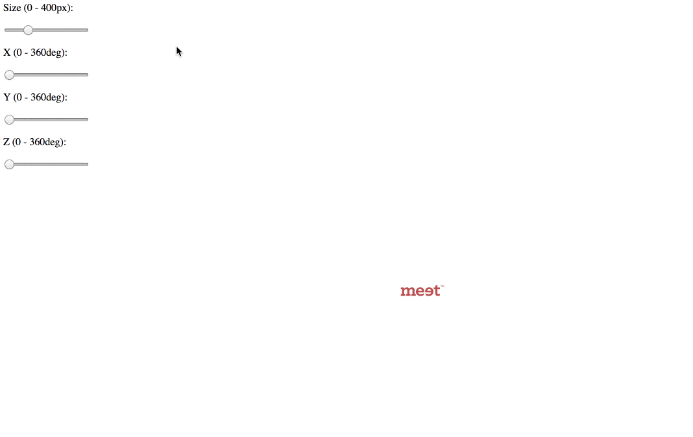
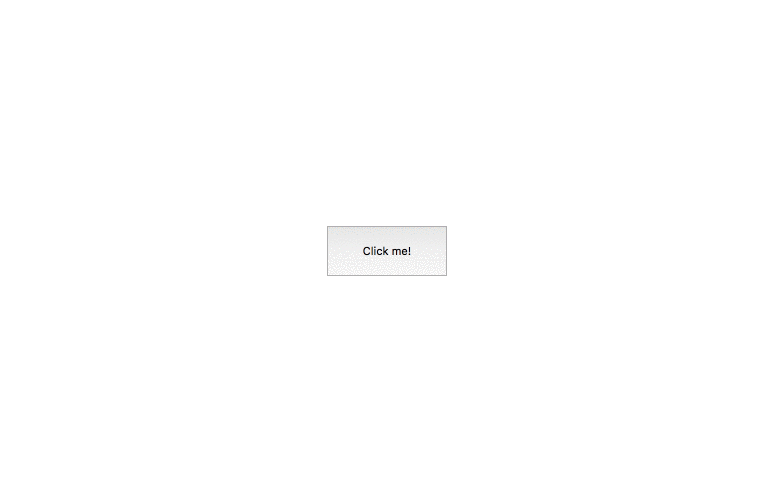
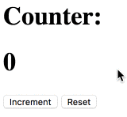
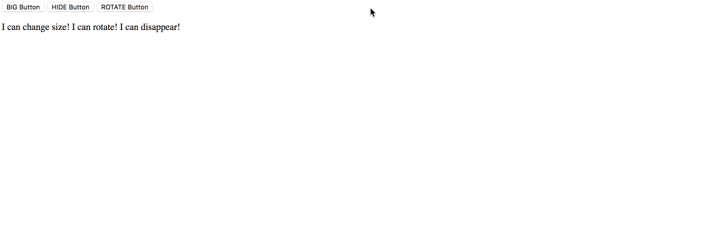

# Day 4: JQuery

## 0 &ensp; Getting Started

1. **Fork** this repository by clicking "Fork" on this page: `https://github.com/meet-projects/y2s18-jquery-1`.

2. In **Terminal**, change directory onto your Desktop: 
`cd ~/Desktop`
3. **Clone** the repository `y2s18-jquery-1` onto your Desktop, replacing `<username>` with your Github username in the following command:
    - `$ git clone https://github.com/<username>/y2s18-jquery-1`.

## 1 &ensp; Labs

### 1.1 &ensp; Editing DOM Styles (`./style`)
0. Make sure you are in the **`~/Desktop/y2s18-jquery-1`** directory. Open `style/style.html` in Sublime Text (or any other text editor). 
1. Find out how to use CSS to rotate elements with [this W3schools article](https://www.w3schools.com/cssref/css3_pr_transform.asp).
2. Open `style.js` in Sublime Text. **Use JQuery** to change the style of the MEET logo:
    - Finish the function `updateSize`. You should set the width of the the MEET logo to equal `newSize` in pixels.
    - Finish the function `updateLeftPosition` and `updateTopPosition` functions.
3. If you finished, get checked off by a TA or instructor. Nice job!

### 1.2 &ensp; JQuery Events (`./events`)
0. Make sure you are in the **`~/Desktop/y2s18-jquery-1`** directory. Open `events/events.html` in Sublime Text (or any other text editor). 
1. Open `events.html` in Sublime Text.
    - Notice that there is a button with an id of `moveButton` on the page.
    - Notice that there is a paragraph with an id of `message` on the page.
2. Open `events.css` in Sublime Text.
    - Notice that `#message` has `position: fixed`. This means that you can move the paragraph in `events.html` around easily.
3. Edit `events.js` in Sublime Text. **Using jQuery**, add code so that when `moveButton` is clicked, the `message` paragraph moves to a random place on the screen. We have provided helper functions `randomX()` and `randomY()`, which return random X and Y positions on the screen.
4. If you finished, get checked off by a TA or instructor. Nice job!

### 1.3 &ensp; Editing DOM Content (`./content`)
0. Make sure you are in the **`~/Desktop/y2s18-jquery-1`** directory. Open `content/content.html` in Sublime Text (or any other text editor). 
1. Open `content.js` in Sublime Text.
2. Add code to `content.js` so that every time the "Increment" button is pressed, the counter increases by `1`.
3. Add code to `content.js` so that when the "Reset" button is pressed, the counter is reset back to `0`.
4. If you finished, get checked off by a TA or instructor. Nice job!

### 1.4 &ensp; Editing DOM Classes (`./classes`)
0. Make sure you are in the **`~/Desktop/y2s18-jquery-1`** directory. Open `classes/classes.html` in Sublime Text (or any other text editor). 
1. Using Sublime Text, **add three buttons to `classes.html`**.
    - The first button should have id of `bigButton` and with `BIG Button` written on it.
    - The second button should have id of `hideButton` and with `HIDE Button` written on it.
    - The third button should have id of `rotateButton` and with `ROTATE Button` written on it.
2. Using Sublime Text, edit `classes.css`. **Finish the `.big` CSS rule.** Any element with the class of `big` should have the following style (**use Google** if you don't know how to use any of these styles):
    - Font size of 72pt.
    - All letters uppercase.
    - Bold.
3. Using Sublime Text, edit `classes.css`. **Finish the `.hidden` CSS rule.** Any element with the class of `hidden` should not appear on the screen.
4. Find out how to use CSS to rotate elements with [this W3schools article](https://www.w3schools.com/cssref/css3_pr_transform.asp) if you don't know how to do so already.
5. Using Sublime Text, edit `classes.css`. **Finish the `.rotated` CSS rule**. If elements have the `rotated` class, they should be rotated 180 degrees.
6. Using Sublime Text, edit `classes.js`.
    - Write code so that when I click `BIG Button`, the `message` paragraph in `classes.html` gets the class `big`.
    - Write code so that when I click `HIDE Button`, the `message` paragraph in `classes.html` gets the class `hidden`.
    - Write code so that when I click `ROTATE Button`, the `message` paragraph in `classes.html` gets the class `rotated`.
7. If you finished, get checked off by a TA or instructor. Nice job!

## 2 &ensp; Extras
### 2.1 &ensp; Editing DOM Styles
1. We created the sliders for you. Use Google to figure out how to use and make HTML Sliders yourself.
2. Use Google to find the different between `oninput` and `onchange`.
3. Use Google to figure out how to use jQuery to get the value of an `input` element. Use this to create three sliders that change the background color of your web page.

### 2.2 &ensp; JQuery Events
1. Use Google to figure out how the `Math.random` function works.
2. Once you are confident you understand how the `Math.random` function works, change the color of the `message` to a random color every time the button is pressed.

### 2.3 &ensp; Editing DOM Content
1. Use Google to find how to add and delete elements to your web page using JQuery.
2. Implement a simple **to-do list application**. The user should be able to add items to do by clicking an "Add" button, and delete items once they have finished them with a "Finished" button.

### 2.4 &ensp; Editing DOM Classes
1. Create a dropdown menu using jQuery. Use [this link](https://www.w3schools.com/howto/howto_js_dropdown.asp) to help you get started, but note that **they do not use jQuery**. Make sure you use jQuery in your version.

## 3 &ensp; Resources
1. CSS Rotate: https://www.w3schools.com/cssref/css3_pr_transform.asp
2. JavaScript `onchange` event: https://www.w3schools.com/jsref/event_onchange.asp
3. JQuery `.val()`: http://api.jquery.com/val/
